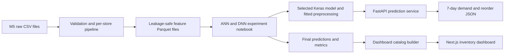

# SmartStock AI

SmartStock AI forecasts each product-store pair's total demand for the next
seven days and turns that forecast into an inventory risk and reorder quantity.
The project uses stored M5 retail sales CSV files and includes an executed
EDA, a leakage-safe feature pipeline, ANN/DNN experiments, final evaluation,
the selected model, a FastAPI service, and a searchable Next.js dashboard.

## Results

The original DNN was selected by validation WAPE before the test set was opened.
On all 853,720 final-test rows across ten stores it achieved:

| Model | MAE | RMSE | WAPE |
|---|---:|---:|---:|
| Seasonal naive | 3.9368 | 8.3140 | 39.2464% |
| Selected DNN | **3.3743** | **7.4473** | **33.6388%** |

This is a 14.29% relative reduction in WAPE. See the complete
[evaluation report](reports/evaluation_report.md), including per-store,
category, demand-level, bias, and limitation analysis.

## Architecture



The feature pipeline calculates lags and rolling statistics separately for each
`store_id` and `item_id`. Chronological train, validation, and test windows use
seven-day purge gaps because the target includes the following seven days. The
API loads the committed Keras model and fitted preprocessing once, transforms a
feature row, predicts demand, and applies the inventory rule. The dashboard uses
a frozen final-forecast catalog containing all 30,490 product-store pairs.

## Repository contents

| Path | Purpose |
|---|---|
| [`reports/problem_statement.md`](reports/problem_statement.md) | Business problem, objective, scope, success criteria, and constraints |
| [`reports/dataset_notes.md`](reports/dataset_notes.md) | Required raw CSV files, validation, storage location, and pipeline usage |
| [`notebooks/01_eda.ipynb`](notebooks/01_eda.ipynb) | Executed EDA with demand, calendar, event, price, and product visualizations |
| [`notebooks/02_feature_engineering.ipynb`](notebooks/02_feature_engineering.ipynb) | Incremental feature-development notebook |
| [`notebooks/03_model_experiments.ipynb`](notebooks/03_model_experiments.ipynb) | Baseline, ANN, DNN, five tuning runs, selection, and final evaluation |
| [`src/data`](src/data) | Runnable raw-data validation, preprocessing, and feature pipeline |
| [`src/models`](src/models) | Reusable model builders, tuning definitions, evaluation, and artifact loading |
| [`models/trained/best_model_20260912T132137305253Z`](models/trained/best_model_20260912T132137305253Z) | Selected DNN, fitted preprocessing, metadata, and checksums |
| [`reports/results/final_test`](reports/results/final_test) | Final metrics, plots, error tables, and prediction files |
| [`api`](api) | FastAPI health and prediction service |
| [`frontend`](frontend) | Next.js inventory dashboard and full product catalog |
| [`tests`](tests) | Pipeline, feature, evaluation, and API tests |

## Quick start from a fresh clone

The committed model and dashboard catalog let you run the demonstration without
downloading or retraining the M5 dataset.

Prerequisites are Git, Python 3.11, and Node.js 20.9 or newer. At least 2 GB of
free disk space is recommended for the full data and training workflow.

### 1. Clone and install Python dependencies

Use Python 3.11 on Windows PowerShell:

```powershell
git clone https://github.com/lasithalankajeewa/ML-StockPredict.git
cd ML-StockPredict
py -3.11 -m venv .venv
Set-ExecutionPolicy -Scope Process -ExecutionPolicy Bypass
.\.venv\Scripts\Activate.ps1
python -m pip install --upgrade pip
python -m pip install -r requirements.txt
```

### 2. Start FastAPI

```powershell
python -m uvicorn api.main:app --reload
```

Open <http://127.0.0.1:8000/health> for the health response and
<http://127.0.0.1:8000/docs> for the interactive API schema. The committed
bundle is discovered automatically. `SMARTSTOCK_MODEL_BUNDLE` is only needed
when you want to load a different bundle.

### 3. Start the dashboard

In a second terminal:

```powershell
cd ML-StockPredict\frontend
npm.cmd install
npm.cmd run dev
```

Open <http://localhost:3000>. The dashboard provides all 30,490 product-store
forecasts with product search, store and risk filters, pagination, historical
demand, stock coverage, and reorder recommendations. M5 does not include live
inventory; current stock and safety stock in the dashboard are deterministic
demonstration inputs.

## Reproduce the data and modeling workflow

The raw and processed datasets are intentionally not committed. Two stored raw
CSV files exceed GitHub's 100 MB per-file limit, and the processed partitions
total hundreds of megabytes.

### 1. Place the stored raw CSV files

Copy the project dataset files into `data/raw/`:

```text
data/raw/calendar.csv
data/raw/sales_train_evaluation.csv
data/raw/sell_prices.csv
```

See [dataset notes](reports/dataset_notes.md) for file descriptions, validation,
and usage instructions.

### 2. Build features

Build one store first to verify memory and disk capacity:

```powershell
python -m src.data.pipeline --stores CA_1
```

Build all ten stores:

```powershell
python -m src.data.pipeline --overwrite
```

Each store is processed separately and saved under
`data/processed/features/store_id=<STORE_ID>/features.parquet`.

### 3. Run the model experiments

The executed notebook already contains every output. To rerun it interactively:

```powershell
jupyter notebook notebooks/03_model_experiments.ipynb
```

To execute every cell noninteractively and preserve a separate run:

```powershell
python -m src.models.train
```

This workflow trains the seasonal naive baseline, ANN, original DNN, and five
DNN configurations; selects by validation WAPE; exports the winner; and runs the
frozen final test evaluation. Full training is compute-intensive and can take
several hours on CPU.

### 4. Rebuild the dashboard catalog

After generating final predictions:

```powershell
python scripts/build_dashboard_catalog.py
```

## API contract

`POST /predict` accepts one engineered feature row plus product ID, current
stock, and safety stock. It returns:

```json
{
  "product": "FOODS_1_001",
  "predictedDemand7Days": 37,
  "currentStock": 12,
  "safetyStock": 6,
  "recommendedReorder": 31,
  "riskLevel": "HIGH"
}
```

Swagger at `/docs` lists every required feature. The inference service never
fits preprocessing on request data.

## Validation commands

```powershell
python -m pytest
python -m src.models.tune
cd frontend
npm.cmd run lint
npm.cmd run build
```

## Demo video

**Demo video:** [Watch or download the SmartStock AI walkthrough](demo/SmartStock_AI_Demo.mp4)
